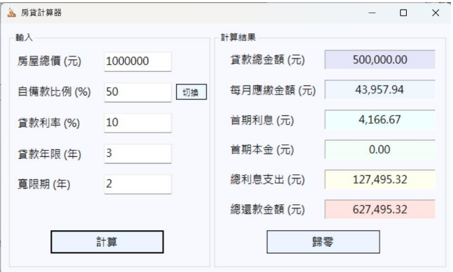

# 房貸計算器
學號：1131203 姓名：侯采妤
## 專案簡介
本專案開發了一款具備嚴謹防呆機制的房貸計算器。除了能精確計算本息攤還外，還能切換自備款單位，並主動攔截「除以零」或「寬限期過長」等不合理輸入，確保程式不崩潰。
## 使用者畫面

## 執行說明書與結果判讀
### 輸入參數說明
請依序在左側輸入區填寫以下欄位：
* 房屋總價 (元)：欲購買房屋的完整成交價格。
* 自備款 (元 / %)：
  * 預設為比例模式 (%)。
  * 可點擊「切換」按鈕變更為金額模式 (元)。
* 貸款利率 (%)：銀行的年利率（例如輸入 2.15 代表 2.15%）。
* 貸款年限 (年)：總貸款的時間長度。
* 限期 (年)：此期間內「只繳利息、不還本金」。若無寬限期請輸
入 0 或保持空白。
### 功能按鈕
* 計算：執行試算，結果將顯示於右側面板，按 Enter 也可以執行。
* 歸零：清空所有輸入欄位，並將結果重置。
* 切換：變更自備款的輸入單位（金額與比例切換）。
### 異常輸入與錯誤防治機制
為避免程式因數學邏輯錯誤崩潰（如除以零），本系統針對以下「不符
合現實」之數值設有自動攔截警告：
1. 房屋總價與自備款邏輯
  * 異常狀況：房屋總價為 0，或自備款「大於等於」總價。
  * 後果：會算出負數的貸款金額。
  * 系統處理：跳出警告視窗，要求輸入正確金額。
3. 貸款年限「除以零」崩潰防治
  * 異常狀況：貸款年限填寫為 0。
  * 系統處理：制要求年限必須大於 0，避免系統因數學錯誤崩
潰。
4. 寬限期極端值處理
  * 異常狀況：寬限期「大於等於」貸款年限。
  * 後果：
    * 若寬限期等於年限，剩餘還款月數為 0，同樣會觸發
「除以零」錯誤。
    * 若寬限期大於年限，則不符金融合約邏輯。
  * 系統處理：系統會彈出警告，提醒寬限期不可超過貸款年限。
5. 利率數值驗證
  * 異常狀況：利率填寫為 0 或超過 100%。
  * 系統處理：限制利率必須在合理範圍內（0.1% ~ 100%），以防
算出誇張的數值。
### 結果判讀說明
計算成功後，右側將呈現以下精確至小數點後兩位的資訊：
* 貸款總金額：實際向銀行借貸的本金。
* 每月應繳金額：
  * 若在寬限期內，此數值為「純利息」。
  * 若過寬限期，此數值為「本金 + 利息」的攤還總額。
* 首期利息 / 本金：顯示第一個月支出的利息與償還本金的佔比。
* 總利息支出：整個貸款週期內支付給銀行的利息總和。
* 總還款金額：原始本金加上所有利息支出的總額。
## 參考資料
1. [國泰世華銀行房貸試算](https://www.cathaybk.com.tw/cathaybk/personal/loan/calculator/mortgage-monthly-payments/)
2. [內政部不動產資訊平台公式參考](https://pip.moi.gov.tw/Publicize/Info/C1040)
